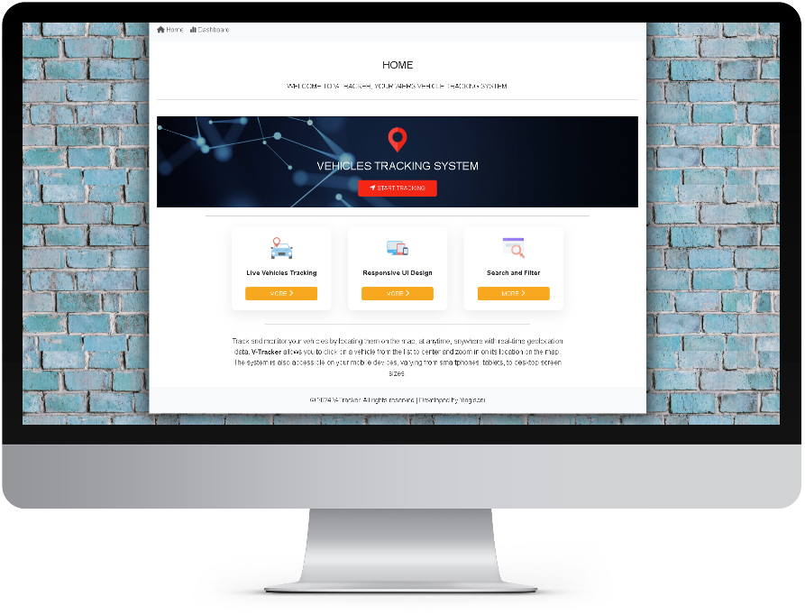

# Vehicle Tracking System

This project was generated with [Angular CLI](https://github.com/angular/angular-cli) version 18.2.7.


 
## Table of contents
- [Summary](#summary)
- [How to run](#how-to-run)
- [References](#references)
- [Licence](#licence)
- [Author Information](#author-information)


## Summary

Vehicle Tracking System is single-page application developed with `Angular 2+` framework. The application allows the user to track, locate and monitor vehicles using Google Maps. 

[Back to top](#table-of-contents)

## Development Environmet

Vehicle Tracking System has been built using the following enviroment:
- Operating System - Windows 11
- Angular CLI - v18.2.11
- Visual Studio Code.
- Node.js - v20.11.1
- Json server (Mock API) - ver 1.0.0-alpha.23

[Back to top](#table-of-contents)

## Technologies
- Responsive Web Design (HTML5, SCSS, Bootstrap5, FontAwesome).
- Angular/Typescrit framawork - v18.2.11
- Fetch API - v18.2.11
- Json server (Mock API) - ver 1.0.0-alpha.3
- Postman - for testing http methods.

## How to run the application

#### 1. Installation
Ensure that you have the following tools installed on your PC:

- Visual Studio Code
- Node.js
- Angular CLI

#### 2. Clone `GitHub` repository

Clone the project into your local machine:  [ Vehicle Tracking System ](https://github.com/mystackbox/prj-vehicle-tracking-system). For more information on how to clone the GitHub repository, see [Cloning GitHub repository](https://docs.github.com/en/repositories/creating-and-managing-repositories/cloning-a-repository).

#### 3. Running the cloned project

Run the following command in your `CLI` to install all packages required before running the project.
```javascript
npm install
```
Run the following command in your `CLI` to start the `localhost` server.
```javascript
ng serve
``` 
Once the `localhost` server is running, navigate to `http://localhost:4200/` or copy and paste the hyperlink in your browser address bar, then press enter. 

#### 4. Google Maps API Integration
Ensure that you have the Google Maps API Key. Open index.html in the source directory of the project and replace `YOUR_API_KEY` with your Google Maps API Key.

```javascript
 <script async src="https://maps.googleapis.com/maps/api/js?key=YOUR_API_KEY&loading=async&callback=Function.prototype&v=weekly"></script>

``` 
[Back to top](#table-of-contents)

#### 5. Mock API
This application uses `json-server` Mock API to mimic real JSON RESTful services. To start json-server, run the following command:

```javascript
npm run json-server
``` 

For more details about Json-server, please follow [ json-server documentation](https://github.com/typicode/json-server).

[Back to top](#table-of-contents)

## References

- For more information related to Angular setup, please check out the [Angular documentation](https://angular.io/docs) page.
- For more information related to Angular CLI, please check out the [Angular CLI Overview and Command Reference](https://angular.io/cli) page.
- For more information related to Node.js, please check out the [Introduction to Node.js](https://nodejs.org/en/learn/getting-started/introduction-to-nodejs) page.
- For more information related to Node Package Manager (NPM), please check out the [npm Docs](https://docs.npmjs.com/) page.


[Back to top](#table-of-contents)

## Licence

MIT License

Copyright (c) [ 2024 ] [ Yingisani ]

Permission is hereby granted, free of charge, to any person obtaining a copy of this software and associated documentation files (the "Software"), to deal in the Software without restriction, including without limitation the rights to use, copy, modify, merge, publish, distribute, sublicense, and/or sell copies of the Software, and to permit persons to whom the Software is furnished to do so, subject to the following conditions:

The above copyright notice and this permission notice shall be included in all copies or substantial portions of the Software.

THE SOFTWARE IS PROVIDED "AS IS", WITHOUT WARRANTY OF ANY KIND, EXPRESS OR IMPLIED, INCLUDING BUT NOT LIMITED TO THE WARRANTIES OF MERCHANTABILITY, FITNESS FOR A PARTICULAR PURPOSE AND NONINFRINGEMENT. IN NO EVENT SHALL THE AUTHORS OR COPYRIGHT HOLDERS BE LIABLE FOR ANY CLAIM, DAMAGES OR OTHER LIABILITY, WHETHER IN AN ACTION OF CONTRACT, TORT OR OTHERWISE, ARISING FROM, OUT OF OR IN CONNECTION WITH THE SOFTWARE OR THE USE OR OTHER DEALINGS IN THE SOFTWARE..

[Back to top](#table-of-contents)
